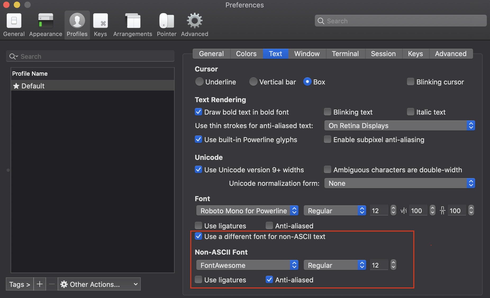

## Prompt styling on my MAC


- Iterm2
- Oh-my-zsh
- Powerlevel9K
- Add font
- Vim config

### Iterm2 
Install from homebrew's package manager
```
brew install iterm2
```

### Oh-my-zsh
First install
```
sh -c "$(curl -fsSL https://raw.githubusercontent.com/robbyrussell/oh-my-zsh/master/tools/install.sh)"
```
Add git plugin. Start out by getting git.
```
brew install git
```
Use oh-my-zsh's git plugin for enabling icons on the prompt visualizing 
git states. See [ohmyzsh docs](https://github.com/ohmyzsh/ohmyzsh) for more information.
In .zshrc
```
plugins=(
  git
)
```
### Powerlevel9K
There are loads of themes to choose from. I chose to go with powerlevel9K theme. Add it to 
oh-my-zsh themes:
```
git clone https://github.com/bhilburn/powerlevel9k.git ~/.oh-my-zsh/custom/themes/powerlevel9k
```
Then you need to enable it in .zshrc
```
ZSH_THEME="powerlevel9k/powerlevel9k"
```

### Add fonts
Download a font (.otf file extension) and install on Mac (dubbel click on file to install) 
The file i chose is called Awesome Font 5 (../images/font_awesome_5.otf)
This command shows what icons are working:
```
get_icon_names
```
iterm2 -> preferences
select checkbox "Use  different font from non-ACSII text"
select font


### Vim config

How to setup [VIM with oh-my-zsh](https://vimawesome.com/plugin/oh-my-zsh)
