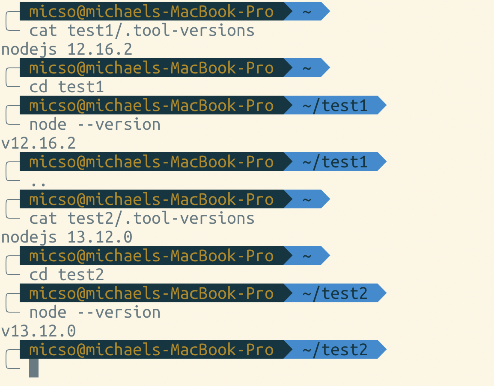

# Version control of frameworks (nodejs)

asdf is a kind of version control for frameworks. For example nodejs.

The thought is that asdf will give me the flexibility to control what version of nodejs I use in each of my projects. Normally nodejs would be set to a global version on my computer when using Homebrew to install it.

If I would use version nodejs@X in project A and projectB, having nodejs
installed globally, I wouldn't be able to choose nodejs@Y for project B and have project A stay on nodejs@Y. asdf should enable this choice.

## setup asdf

Install asdf-vm with git. Clone the repo and checkout the latest stable build 
```
git clone https://github.com/asdf-vm/asdf.git ~/.asdf
cd ~/.asdf
git checkout "$(git describe --abbrev=0 --tags)"

```
use oh-my-zsh plugin for asdf
```
# append completions to fpath
echo -e "\nfpath=(${ASDF_DIR}/completions $fpath)" >> ~/.zshrc
# initialise completions with ZSH's compinit
echo -e "\nautoload -Uz compinit && compinit" >> ~/.zshrc
```

This tutorial was based on following [official asdf-vm documentation](https://asdf-vm.com/#/core-manage-asdf-vm)

## setup asdf-nodejs

Install these prerequisites

```
brew install coreutils && brew install gpg
```
coreutils - basic file, shell and text manipulation utilities of the GNU operating system
gpg - the GNU Privacy Guard allows you to encrypt and sign your data and communications. Provides ssh.


## install plugin
```
asdf plugin-add nodejs https://github.com/asdf-vm/asdf-nodejs.git
```
Import the Node.js release team's OpenPGP keys to main keyring
```
bash ~/.asdf/plugins/nodejs/bin/import-release-team-keyring
```

## install version
```
asdf install <name> <version>
# asdf install nodejs 13.12.0
```

## manage versions
```
asdf global <name> <version> [<version>...]
asdf local <name> <version> [<version>...]
```
global - writes the version to $HOME/.tool-versions.
local - writes the version to $PWD/.tool-versions, creating it if needed.

## Example
Nodejs 13.12.0 and 12.16.0 was first installed.




